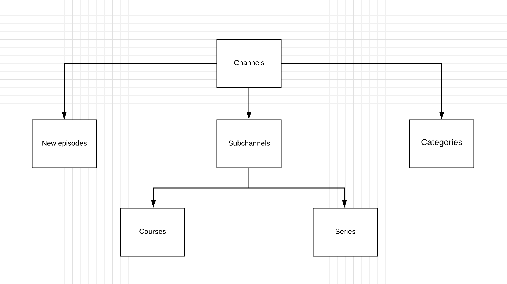

# Mind valley demo application:

1. Architecture used is MVP
2. Test driven development
3. Supports all iPhones and iPads

# High level overview:

Channel component consists of 3 child views:

	i. New episodes (Has it's own model, view and presenter - based on horizontal collection view)

	ii. Subchannels (Has it's own model, view and presenter - based on table view)
		a. Consists of 2 kinds of child views
		b. Courses (Has it's own model, view and presenter - based on horizontal collection view)
		b. Series (Has it's own model, view and presenter - based on horizontal collection view)

	iii. Categories (Has it's own model, view and presenter - based on horizontal collection view)

	
